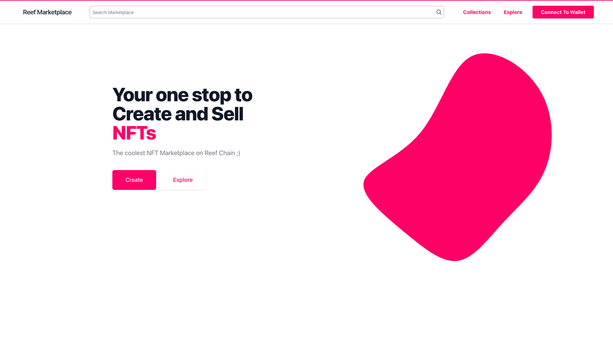
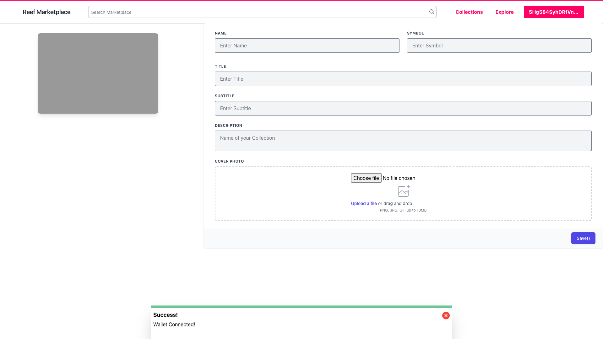
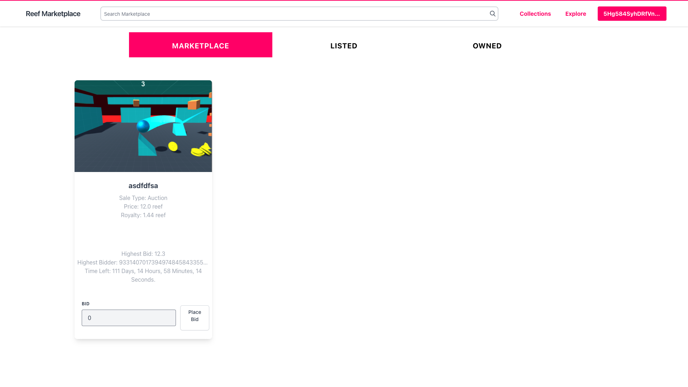
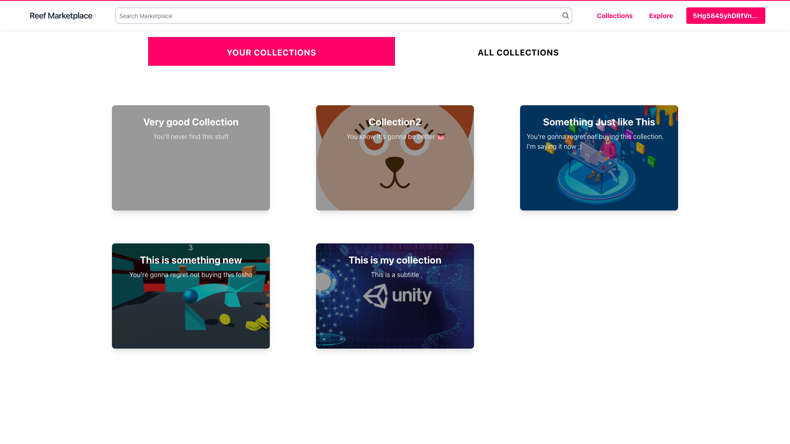

# Reef NFT Marketplace

## Overview

Your one stop to Create and Sell NFTs. An NFT Marketplace with EVM Solidity support on Reef chain
 

- [Demo Website](https://reef-marketplace-7236e.web.app/)
- [Demo Video](https://youtu.be/XmqtBVTvjIU)

## Contracts

Deployed at -  
Collection Factory - 0xefE7bad65Ab1A85F736ebC91EC441ee4e027eE34  
Market Place - 0xB10267c1FCcE87BeFCBDeaF60662ce5C1c4f7AFd  
Collections contracts are deployed through Collection Factory.   

### Key Terms

- Collections - Independent ERC721 and EIP2198 Smart Contract which acts as the container for any particular set of NFT's for the user
- Collection Factory - Smart Contract that deploys Collection contracts and stores metadata
- Market Place - Smart Contract that manages, Buy, Sell and Auction of NFTs
   

### Collections

- User can create an Independent ERC721 Smart Contract with their choice of name, symbol and metadata
- User can then create any number of NFTs in this contract
- These NFTs need not be sold and user can own and showcase if they want
- Each contract follows ERC721 as well as EIP2198 standard for NFT royalties, therefore users can define any amount less than 20% as their royalty shares on resale
- Users can define any number of attributes for each NFT

### MarketPlace

- User can place any NFT they own on the Marketplace
- If the NFT follows EIP2198 then its royalty amount is calculated, otherwise it stays 0
- User can choose between fixed price sale and auction
- User can define number of days they want the auction to go on for
- User can define the base price to start the Auction
- Anyone can bid at the auction if they bid higher than both base price and highest bid
- Highest bidder at the end of the auction can retrieve the NFT
- User can unlist at any time as long as the NFT remains unsold

## Frontend

### Screenshots

<b>Home Page</b>

<b>Create Collection</b>

<b>Marketplace</b>

<b>Explore Collections</b>

### Tech Stack Used

- React
- React Context
- Tailwind
- Ethers.js

## Future Expansion

- We can add more types of sale methods like blind auction and curve auctions
- We can add support for ERC1155
- We can add support for lazy minting
- We can also add NFT as collateral lending system inbuilt in the marketplace
